Chủ nhật vừa rồi (30/11/2025), mình có cùng 1 vài người bạn ghé chơi 1 giải CTF khá lạ, nhưng sau 1 hồi tìm hiểu thì mới biết chỉ có mình thấy lạ thôi :v Vì nó đã được tổ chức từ 2021 tới nay rồi, dưới đây là wu RE mình làm được trong giải.
***
# Apprentice of the IR Forge
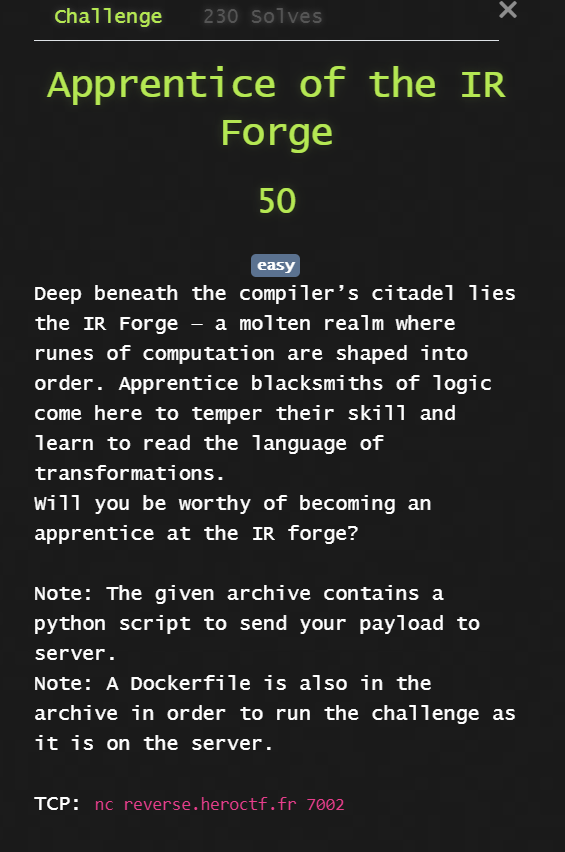
Với bài này, đề cho một tệp nén `forge.zip`. Khi giải nén, ta thu được các tệp sau:
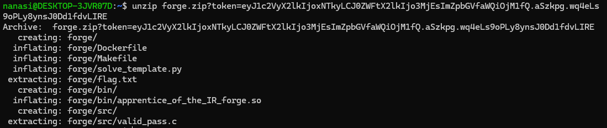

Thử `cat flag.txt` thì được kết quả là ***Hero{FAKE_FLAG}***. Ta cũng thấy có một instance trên nền tảng CTFd để nộp bài, vậy hướng đi là phân tích local rồi sẽ thử trên máy chủ sau cùng. 

Bài này author lại đưa cho cả `Makefile` (file cấu hình để biên dịch code) và file source `valid_pass.c`. Có lẽ đây sẽ là 1 bài không quá khó.

Vì lí do trên nên mình đã check file `Makefile` xem thử và đây là kết quả:
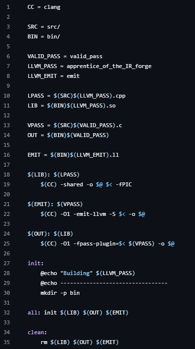

Thử chạy makefile thì nó bị ntn: 
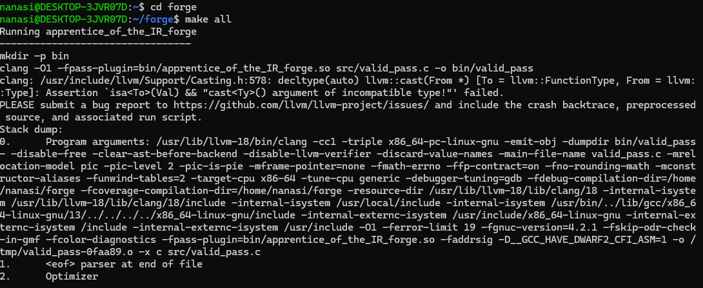
Thoạt nhìn, có vẻ như đã xảy ra lỗi. Mình sẽ thử kiểm tra file source:
```c

int main(void) {
  return 0;
}
```
Nội dung tệp có vẻ khá vô nghĩa? Thế còn đống `bin/apprentice_of_the_IR_forge.so` thì sao? 

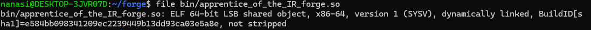
Rồi tới đây thì rõ rồi. Đây không phải là 1 bài quá dễ như mình nghĩ :D Bài này có lẽ sẽ focus vào rev structure của compiler ***LLVM***.

Vì sao mình có thể khẳng định chỉ qua những thao tác trên? Có 2 clue khá quan trọng nếu bạn để ý kĩ ở bài này: 
- ***Lệnh trong `Makefile`***, cụ thể nó cho ta biết `bin/apprentice_of_the_IR_forge.so` có vai trò gì, nhìn vào đoạn này:
```makefile
$(OUT): $(LIB)
    $(CC) -O1 -fpass-plugin=$< $(VPASS) -o $@
```
   `$(CC)` - cái này được định nghĩa là clang. Phần `-fpass-plugin` là một flag đặc trưng của compiler Clang/LLVM. Flag này cho phép compiler load một LLVM Pass Plugin từ một shared library trong lúc compile, Ở đây, `$<` chính là dependency đầu tiên của target, tức: `bin/apprentice_of_the_IR_forge.so`. Nói cách khác thì file này không đơn thuần là 1 lib :D Nó chứa một (hoặc nhiều) `LLVM Pass`.

- Clue còn lại thì đơn giản nằm ở định dạng `.so` thôi :v Tất nhiên chỉ nhìn vào đấy thì chưa thể kết luận nó là gì cả, nhưng khi nhìn lại đoạn Makefile ở trên, ta thấy file này được truyền trực tiếp cho Clang thông qua flag `-fpass-plugin`. Từ đó thì có thể hiểu đơn giản là: Clang đang load file `.so` này như một LLVM Pass Plugin. Bạn cũng có thể bắt gặp những file `.so` như thế này trong các bài liên quan tới Android, cái đó chúng ta sẽ nói ở 1 bài viết khác :D

## LLVM Core:

Để dễ hình dung, hãy xem qua quy trình biên dịch của LLVM: 
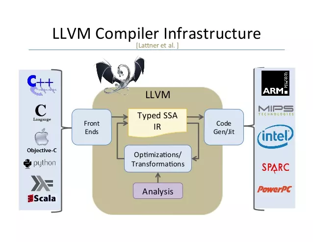
- ***Code C $\rightarrow$ IR***: Khi ta compile `valid_pass.c` bằng clang, code C sẽ được chuyển thành `IR` (Intermediate Representation). IR là một dạng ngôn ngữ cấp thấp, dễ đọc và được LLVM sử dụng để optimize code.

- Tiếp theo là đến `apprentice_of_the_IR_forge.so`: 
Trong Makefile, Clang được chạy kèm với:

```
-fpass-plugin=bin/apprentice_of_the_IR_forge.so
```

Tức là trong quá trình compile, Clang sẽ load thêm file .so này và sử dụng nó như một LLVM Pass. Nói dễ hiểu thì thay vì để Clang xử lý IR một mình, author đã nhét thêm một đoạn code vào giữa lúc compile để soi và kiểm tra IR


- Cuối cùng là phần `check`: Pass này sẽ duyệt qua các function trong IR và check xem chúng có đúng với cấu trúc mà chall expected hay không. Nếu đúng thì in Flag ra. Còn nếu sai thì nó sẽ báo lỗi, chính là đống lỗi mà ta đã thấy ở bước trước.

Có thể hình dung cả quá trình như này:
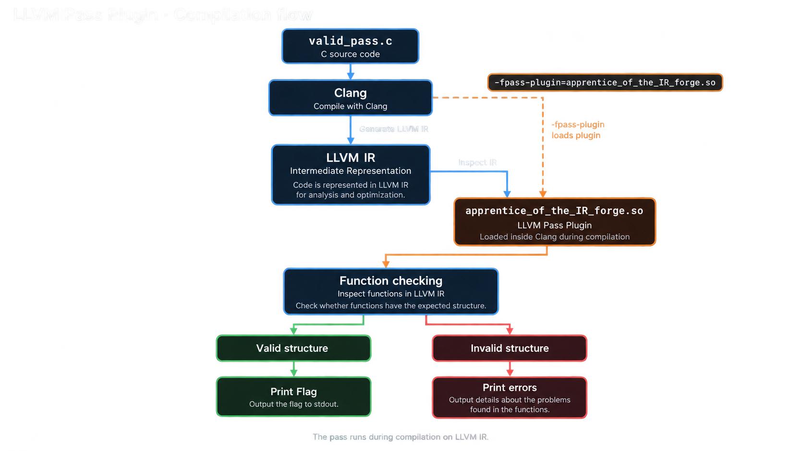


## Solution: 
Quay lại bài toán, ta đang có một LLVM Pass tùy chỉnh. Việc đầu tiên có thể làm là xem thử file `.so` này đang export những symbol nào:


`nm bin/apprentice_of_the_IR_forge.so`
Output sẽ có khá nhiều thứ, nhưng để ý một vài dòng:


```bash
...
0000000000019948 d __TMC_END__
                 U _Unwind_Resume@GCC_3.0
000000000000e360 T _Z20get_pass_plugin_infov
                 U _ZdlPvm
0000000000019978 V _ZGVZN4llvm11getTypeNameIN4hero11custom_passEEENS_9StringRefEvE4Name
0000000000019960 V _ZGVZN4llvm11getTypeNameINS_27ModuleToFunctionPassAdaptorEEENS_9StringRefEvE4Name
0000000000011890 W _ZN4hero11custom_pass3runERN4llvm8FunctionERNS1_15AnalysisManagerIS2_JEEE
...
```
Có một chi tiết khá thú vị ở đây. Giải mà chúng ta đang chơi là HeroCTF, và trong đống symbol này lại xuất hiện rất nhiều string `hero` trong những cái tên đã bị mangled.

Thử lọc riêng những symbol có chứa `hero` xem sao:

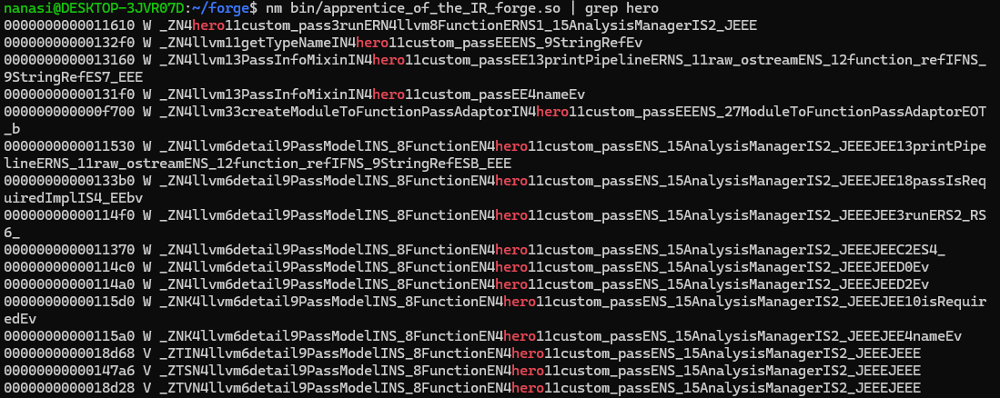

Như vậy chúng ta loại được một đống symbol linh tinh của C/C++ và LLVM, chỉ còn lại những thứ có vẻ liên quan trực tiếp đến challenge.

Vậy thì flag chắc phải nằm đâu đó trong mớ này :v

Bước tiếp theo là load `.so` này bằng một disassembler/decompiler. Ở đây mình dùng IDA Pro để xem thử từng symbol.

Sau một hồi mò từng hàm, mình để ý đến symbol:
```c
_ZN4hero11custom_pass3runERN4llvm8FunctionERNS1_15AnalysisManagerIS2_JEEE
```
Nếu demangle nó ra thì ta được đại khái:
```c
hero::custom_pass::run(llvm::Function &, ...)
```

Đến đây có lẽ bạn đọc sẽ thắc mắc tại sao từ một string trông cực kì random  `_ZN4hero11custom_pass...` lại có thể biết nó là `hero::custom_pass::run`?


## C++ Name Mangling?
Nói sơ 1 chút vì sao mình giải mã ra được như vậy đi? 

C++ có một đặc điểm mà C không có, đấy là function overloading. Ví dụ: 
```cpp
int add(int a, int b);
float add(float a, float b);
```
Cả hai đều tên là add, nhưng tham số khác nhau. Vấn đề là ở mức object file/assembly, mỗi function cần có một symbol name riêng. Vì vậy compiler phải biến tên function cùng với thông tin về namespace, class và tham số thành một string đủ để phân biệt chúng - cái này người ta gọi là `Name Mangling`. Nhưng takhông cần ngồi giải từng ký tự. Có tool làm việc đó cho mình. Chẳng hạn như ***c++filt***, trên Linux có thể xài nó như sau: 
```bash
echo "_ZN4hero11custom_pass3runERN4llvm8FunctionE..." | c++filt
```
Nó sẽ cố gắng chuyển symbol đã bị mangled về tên C++ dễ đọc hơn.

Các tools như IDA Pro, Binary Ninja... cũng có chức năng demangle tích hợp, nên khi mở binary lên chúng thường tự động hiển thị tên đã được giải mã.

Thật ra nếu đã rev đủ lâu, đặc biệt là gặp nhiều bài liên quan đến C++/LLVM, bạn cũng sẽ bắt đầu nhận ra một số pattern trong symbol.

| Phần Mã hóa | Ý nghĩa | Giải mã |
| -------- | -------- | -------- |
| _Z     | Bắt đầu chuỗi mã hóa    |      |
| N | Bắt đầu một Namespace hoặc tên lồng nhau |  |
| 4hero     | Tên có 4 ký tự: hero (Namespace)    |    hero  |
| 11custom_pass     | Tên có 11 ký tự: custom_pass (Class)    |    custom_pass  |
| 3run     | Tên có 3 ký tự: run (Method)    |    run  |

***
Quay lại với hàm vừa tìm được. Khi `cross-reference` trong IDA, ta thấy nó xuất hiện cùng với:
```c
llvm::PreservedAnalyses *__fastcall
llvm::detail::PassModel<
    llvm::Function,
    hero::custom_pass,
    llvm::AnalysisManager<llvm::Function>
>::run(...)
```
Có một thứ rất đáng chú ý:

```c
PassModel<llvm::Function, ...>
```
LLVM có rất nhiều loại Pass khác nhau. Ở đây `PassModel` đang được build với `llvm::Function`, nên có thể hiểu rằng `custom_pass` đang hoạt động ở function level.

Nói đơn giản thì Pass này sẽ lần lượt nhận từng Function trong LLVM IR để kiểm tra, vậy là thay vì phải mò cả đống IR, ta đã có một hướng khá rõ, đi xem cái Pass này soi từng Func như nào.

Sau khi đi vào `hero::custom_pass::run`, ta thấy một đoạn logic đại khái như sau:


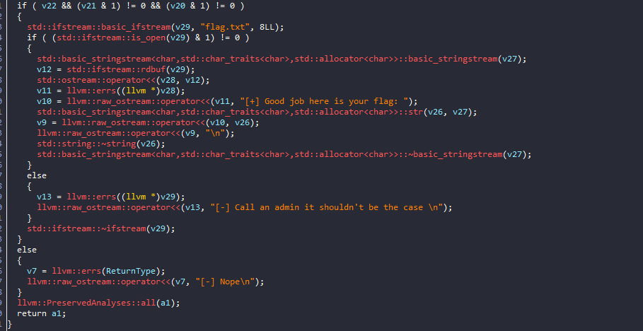

Nhìn đơn giản thì Pass đang check ba điều kiện. Nếu cả ba biến `v22`, `v21` và `v20` đều là true, flag sẽ được in ra.

Vậy thì cứ tách từng biến ra xem thôi :))

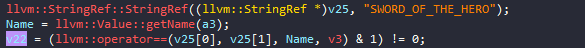
Bắt đầu với `v22` trước, ở đây Pass lấy tên của function rồi so sánh với string: `SWORD_OF_THE_HERO`
Vậy yêu cầu đầu tiên khá rõ: tên function phải là `SWORD_OF_THE_HERO`.

***
Tiếp theo là đối với `v21`: 
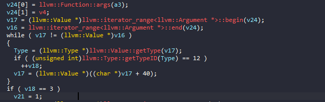
```C
if ( TypeID == 12 ) // Nếu kiểu là 12
   ++v18; // Tăng biến đếm
```
***
Rồi `TypeID` là cái gì? 

Nếu bạn không biết thì để mình tìm hiểu rồi nói cho bạn biết, LLVM được viết bằng C++, và các loại Type trong LLVM được biểu diễn bằng những giá trị enum tương ứng. Ví dụ trong source của LLVM có thể bắt gặp những giá trị kiểu:
```c
enum TypeID {
    VoidTyID = 0,
    FloatTyID = 2,
...
IntegerTyID = 12,
...
PointerTyID = 20
}
```
Khi compiler build thành binary, những cái tên như `IntegerTyID` không còn xuất hiện trực tiếp trong code máy nữa. Thứ chúng ta nhìn thấy có thể chỉ còn lại con số 12.

Vậy nên khi gặp:
```c
getTypeID() == 12
```
ta có thể đặt câu hỏi: `12 trong LLVM TypeID là kiểu gì?`


Vì LLVM là một dự án `Open Source`, nên toàn bộ mã nguồn của nó (bao gồm các file `Header .h` chứa định nghĩa `enum`) đều được công khai trên Internet (yea nếu bạn kh biết thì giờ biết rồi đó). 

Và nó nằm ở [đây](https://llvm.org/doxygen/IR_2Type_8h_source.html). Bạn có thể click vào xem, thứ chúng ta cần quan tâm chỉ là cái này: 
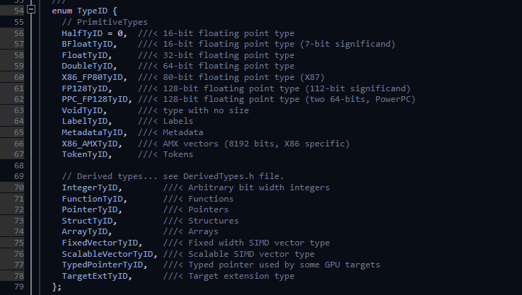

Và ở đây ta biết:

```
12 → IntegerTyID
```
Tức là đoạn trên đang đếm xem function có bao nhiêu tham số kiểu int. Sau cùng là nếu `v18 == 3` thì `v21 = true`. Vậy, yêu cầu số 2 là: function phải nhận đúng 3 tham số kiểu int.

Ví dụ:
```c
int foo(int a, int b, int c);
```
hoặc trong trường hợp này ta có thể dùng:
```c
uint64_t
```
vì nó cũng được LLVM biểu diễn dưới dạng int.

***
Cuối cùng là v20:

Lần này ta lại gặp TypeID, nhưng giá trị được kiểm tra là 14. Tra tiếp trong Type.h bên trên: 
```
14 → PointerTyID
```
Vậy đoạn này đang check xem kiểu trả về của function có phải pointer hay không. Vậy yêu cầu cuối là hàm phải trả về 1 con trỏ :D `int*` hay `void*` gì cũng được

***
Đến đây thì bài gần như xong r đấy :v Hàm chúng ta cần tạo phải thỏa mãn cả ba điều kiện:

- Tên: `SWORD_OF_THE_HERO`
- Có đúng 3 parameter kiểu int.
- Return Type là pointer.

Ta có thể viết 1 hàm đơn giản như sau:

```C
#include <stdint.h> // nhớ thêm thư viện để Clang nó hiểu uint64_t là gì nha :v
int* SWORD_OF_THE_HERO(uint64_t a, uint64_t b, uint64_t c) {
  return 0;
}
```

Sửa file `valid_pass.c` thành như trên và chạy lại toàn bộ, mình sẽ thu được flag: 
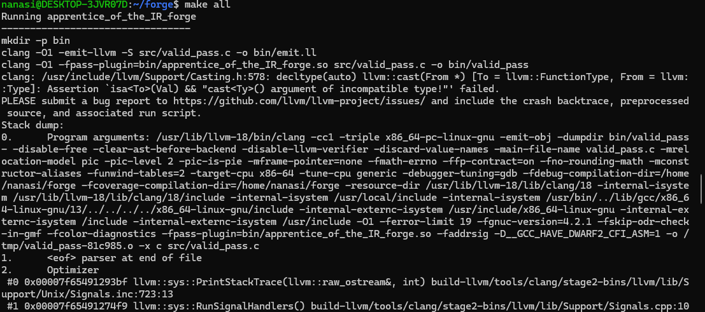
Oops sao lại lỗi rùi nhỉ? Sau 1 hồi gpt thì lý do lần này không nằm ở function nữa mà nằm ở môi trường build.

WSL của mình đang dùng Clang 18, trong khi file .so mà tác giả cung cấp được build bằng một phiên bản LLVM khác. LLVM Pass Plugin thường phụ thuộc khá chặt vào version của LLVM/Clang mà nó được build cùng.

Đó cũng là lý do author có cung cấp sẵn Docker trong challenge. Chỉ cần chạy challenge trong đúng environment của Docker, hoặc đơn giản hơn là sử dụng server mà BTC cung cấp, sau đó compile lại valid_pass.c với function ở trên.

Đơn giản vậy thôi là ta có flag rồi:

Flag: ***Hero{Yu0_f0rG3d_y0uR_oWn_p47H_4pPr3nT1cE}***
## Một chút tản mạn về idea của chall:
Sau một buổi mò mẫm và hỏi trực tiếp tác giả, mình cũng xác nhận được thêm một chút về ý tưởng ban đầu của challenge:

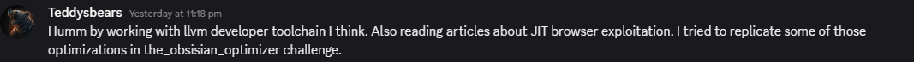

Challenge thực sự được build dựa trên LLVM, chủ yếu là Clang và các core lib của LLVM.

Một nguồn cảm hứng khác của tác giả là `JIT Browser Exploitation`. Tuy nhiên, phần mình vừa solve hoàn toàn xoay quanh Clang, LLVM IR và custom LLVM Pass, chứ không động gì vào JIT :v 

# The Chef's Secret Recipe
Vì quá lười viết wu nên mình sẽ chỉ để video mình debug và giải nó ở [đây](https://drive.google.com/file/d/1vWrUIwE-Dm4RvSbgHXJ7BtiJb7v15Nx1/view?usp=sharing), mình tin là bạn cũng sẽ giải dc nó thôi, vì nó dễ mà :>
